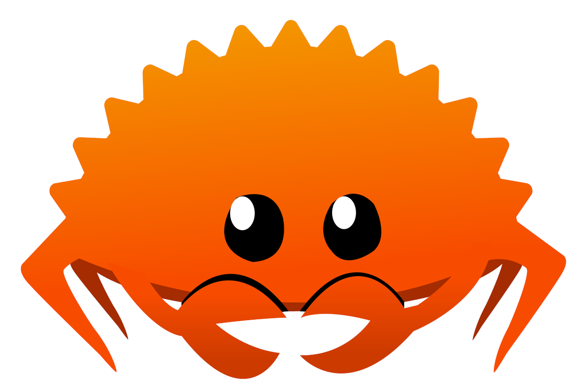

Przegląd
===

Rust jest kompilowanym, wieloparadygmatowym językiem ogólnego przeznaczenia
skupiającym się, między innymi, na bezpieczeństwie, niezawodności i wydajności.

<!-- column_layout: [3, 2] -->

<!-- column: 1 -->


<!-- column: 0 -->

## ważne cechy:
- bezpieczeństwo pamięci bez potrzeby automatycznego odśmiecania
- zapobieganie wyścigom danych między wątkami
- silny system typów inspirowany językami funkcyjnymi (bazuje na nim obsługa błędów)
- możliwość programowania niskopoziomowego (wskaźniki, unsafe, inline assembly)
- interoperacyjność z językiem C (i nie tylko)
- makra (deklaratywne i proceduralne)
- wydajność porównywalna z językiem C
- użycie infrastruktury LLVM
- z kompilatorem dostarczany jest menadżer pakietów Cargo zintegrowany z repozytorium [crates.io](https://crates.io) (i inne narzędzia)

<!-- reset_layout -->
<!-- end_slide -->

Maskotka
---
Maskotką języka Rust jest krab Ferris.



<!-- end_slide -->

Popularność
---

<!-- column_layout: [1, 1] -->

<!-- column: 0 -->

# Firmy i projekty używające języka Rust

- AWS
- Google
- Huawei
- Microsoft
- Facebook
- Cloudflare
- Dropbox
- Coursera
- Mozilla
- Discord
- Figma
- Npm
- SurrealDB
- 1Password
- Wire

i wiele innych

<!-- column: 1 -->

# Stack Overflow Development Survey

Przez ostatnie 8 lat (2016-2023) Rust
zajmował pierwsze miejsce jako najbardziej uwielbiany język programowania.

- 2023: 84.66%
- 2022: 86.73%
- 2021: 86.98%
- 2020: 86.1%
- 2019: 83.5%
- 2018: 78.9%
- 2017: 73.1%
- 2016: 79.1%

<!-- reset_layout -->
<!-- end_slide -->

Wprowadzenie
===

# Hello World
```rust
fn main() {
    println!("Hello, world! 🦀"); // println! is a macro
}
```

# Kompilacja

```
$ rustc hello_world.rs
$ ./hello_world
Hello, world! 🦀 
```
W większości przypadków używanie narzędzia Cargo do budowania projektów jest preferowane od bezpośredniego wywoływania kompilatora.

<!-- end_slide -->

Typy proste
---

<!-- column_layout: [1, 1] -->

<!-- column: 0 -->

# Typy liczbowe

## Liczby całkowite
| **rozmiar**       | **ze znakiem** | **bez znaku** |
|-------------------|----------------|---------------|
| 8                 | `i8`           | `u8`          |
| 16                | `i16`          | `u16`         |
| 32                | `i32`          | `u32`         |
| 64                | `i64`          | `u64`         |
| 128               | `i128`         | `u128`        |
| rozmiar wskaźnika | `isize`        | `usize`       |

Liczby ze znakiem używają kodu uzupełnień do dwóch.

## Liczby zmiennoprzecinkowe
Typy `f32` oraz `f64` zgodne ze standardem IEEE 754-2008.

# Typ "nigdy" `!`
- nie ma możliwych wartości
- obecnie niestabilny, zamiast niego jest używany `Infallible` (pusty enum)

<!-- column: 1 -->

# Typ logiczny `bool`

# Typy tekstowe

## `char`
- zajmuje 4 bajty
- reprezentuje wartość skalarną Unikodu

## Wycinek napisu `str`
- `[u8]` z dodatkowym założeniem poprawności jako zakodowanie ciągu wartości skalarnych Unikodu w UTF-8
- zwykle używany poprzez typy wskaźnikowe np. `&str`

# Typ jednostkowy `()`
- pusta krotka
- zerowy rozmiar
- jedna możliwa wartość

<!-- reset_layout -->
<!-- end_slide -->

Zmienne
---

```rust
fn takes_i64(_x: i64) {}

fn main() {
    let 𐐘: i32; // explicit type i32 (i32 is also the default for integers)
    let y = 10u8; // type inferred from literal u8
    let mut a = 1; // variables are immutable by default
    let b = 2;
    let _żółć: (); // underscore prefix suppresses unused variable warning

    a += y + 1; // type of a inferred here u8
    takes_i64(b); // type of b inferred here i64
     𐐘 = 5; // variables can be initialised after declaration

    println!("a = {}\n", a);
    let a = 0.5f64; // shadowing

    println!("𐐘 = {}", 𐐘);
    println!("y = {}", y);
    println!("a = {}", a);
    println!("b = {}", b);
}
```

<!-- end_slide -->

Typy sekwencyjne
---

# Krotki `(T1, T2, T3, ...)`
- lista wartości o różnych typach
- stała długość
- Przykłady:
    - ()
    - (u8,)
    - (i64, i64)
    - ((), u8, f32)
- pola nazywane używając kolejnych liczb całkowitych odpowiadających pozycji w liście typów: `0`, `1`, `2` itp.

# Tablice `[T; N]`
- lista długości `N` wartości o tym samym typie `T`
- sprawdznie poprawności dostępu do elementów tablicy na etapie kompilacji i podczes działania programu

# Wycinki `[T]`
- typ o dynamicznym rozmiarze reprezentujący "widok" na listę elementów typu `T`
- zwykle używany poprzez typy wskaźnikowe
- sprawdznie poprawności dostępu do elementów tablicy na etapie kompilacji i podczes działania programu

<!-- end_slide -->

Przepływ sterowania
---

# Bloki
```rust
let x = -2;
{
    let x = 10; // item declarations in blocks are scoped to the block
    println!("x is {}", x); // x is 10
    // default return value of a block is ()
}
println!("x is {}", x); // x is -2
let y = {
    let y = 2;
    y * y - x
    /* if the final expression is not followed by a semicolon
    it becomes a return value of the block
    */
};
println!("y is {}", y); // y is 6
```

<!-- end_slide -->

Przepływ sterowania
---

# `if`

```rust
let x = -2;
if x < 0 {
    println!("x is negative");
} else if x > 0 {
    println!("x is positive");
} else {
    println!("x is zero");
}
let y = if x < 0 { -x } else { x };
println!("y is {}", y);
```
```
x is negative
y is 2
```

<!-- end_slide -->

Przepływ sterowania
---

# `loop`
```rust
let mut a = 1;
let b = loop {
    a *= 2;
    if a > 10 {
        break a;
    }
};
println!("first power of 2 greater than 10 is {}", b);
```
```
first power of 2 greater than 10 is 16
```

<!-- end_slide -->

Przepływ sterowania
---

# `while`
```rust
let mut a = 1;
while a <= 3 {
    println!("a is {}", a);
    a += 1;
}
```
```
a is 1
a is 2
a is 3
```

<!-- end_slide -->

Przepływ sterowania
---

# `for`
```rust
for i in 0..5 {
    println!("{}", i);
}
let arr = ["dog", "cat", "horse"];
for animal in arr {
    println!("{}", animal);
}
```
```
0
1
2
3
4
dog
cat
horse
```

<!-- end_slide -->

Przepływ sterowania
---

# Etykiety

```rust
'outer: loop {
    println!("outer");
    loop {
        println!("inner");
        break 'outer;
    }
    println!("never printed");
}

let a = 'some_block_label: {
    let a = true;
    if a {
        break 'some_block_label false;
    } else {
        break 'some_block_label true;
    }
};
println!("a is {}", a);
```

<!-- end_slide -->

Przepływ sterowania
---

# `continue`
```rust
for i in 0..=5 {
    if i < 5 {
        continue;
    }
    println!("{}", i);
}
```
```
5
```

<!-- end_slide -->

Typy definiowane przez użytkownika
---

# Struktury

<!-- column_layout: [1, 1] -->
<!-- column: 0 -->

## Struktury z nazwanymi polami
```rust
struct StructName {
    field1: T1,
    field2: T2,
    field3: T3,
    ...
}
```
podobne do struktur w C

<!-- column: 1 -->

## Struktury krotkowe
```rust
struct StructName(T1, T2, T3, ...);
```
podobne do krotek

## Struktury jednostkowe
```rust
struct StructName;
```
podobne do `()`

<!-- reset_layout -->
<!-- end_slide -->

Typy definiowane przez użytkownika
---

# Typy wyliczeniowe
```rust
enum EnumName {
    Variant1,       // implicit discriminant 0
    Variant2 = 123, // explicit disscriminant 123
    Variant3,       // implicit discriminant 124
    ...
}

```
podobne do typów wyliczniowych w C
```rust
enum NumName {
    Variant1,
    Variant2(bool, u8),          // optional tuple constructor
    Variant3 { x: f32, y: f32 }, // optional struct constructor
    Variant4(i32),
    ...
}
```
podobne do tzw. rekordu z wariantami

<!-- end_slide -->

Typy definiowane przez użytkownika
---

# Unie

```rust
union StructName {
    field1: T1,
    field2: T2,
    field3: T3,
    ...
}
```
- podobne do unii w C
- jak struktury, ale pola dzielą pamięć
- dostęp do elementów jest niebezpieczny
- pewne ograniczenia typów pól

<!-- end_slide -->

Dopasowanie do wzorca
---

```rust
let number = 7;
    match number {
    1 => println!("lonely"),
    2 | 3 | 5 | 7 | 11 => println!("small prime"),
    13..=19 => println!("teen"),
    x if x < 0 => println!("negative"),
    _ => println!("not special"),
}

let a = true;
let b = match a {
    true => 1,
    false => 0,
};
println!("b is {}", b);
```
```
small prime
b is 1
```

<!-- end_slide -->

Dopasowanie do wzorca
---

```rust
struct Color {
    r: u8,
    g: u8,
    b: u8,
}
fn main() {
    let c = RGB { r: 64, g: 0, b: 0 };
    match c {
        RGB { r: 0, g: 0, b: 0 } => println!("black"),
        RGB { r: r @ 0..=80, g: 0, b: 0, } => println!("some sort of dark red {r}"),
        RGB { b: 255, .. } => println!("something with maximum blue"),
        RGB { r, g, b } => println!("r: {}, g: {}, b: {}", r, g, b),
    }
    let RGB { r: red, g: green, b: blue, } = c;
    println!("red: {}, green: {}, blue: {}", red, green, blue);
}
```
```
some sort of dark red 64
red: 64, green: 0, blue: 0
```

<!-- end_slide -->

Dopasowanie do wzorca
---

```rust
let some_tuple: (u8, bool, f32, char) = (10, false, 0.1, 'Σ');
match some_tuple {
    (0..=9, .., 'α'..='ω' | 'Α'..='Ω') => println!("digit and a greek letter"),
    (.., 'Σ') => println!("ends with a letter sigma"),
    (0, ..) => println!("starts with zero"),
    (_, true, _, c) => println!("second value is true and fourth is {}", c),
    entire_tuple => println!("{:?}", entire_tuple),
}
let (a, c, d, e) = some_tuple;
println!("a: {}, c: {}, d: {}, e: {}", a, c, d, e);
```
```
ends with a letter sigma
a: 10, c: false, d: 0.1, e: Σ
```

<!-- end_slide -->

Dopasowanie do wzorca
---

```rust
let arr = [1, 2, 3, 4, 5];
match arr {
    [0, .., last] => println!("arr[0]: 0, last: {}", last),
    [first, middle @ .., 5] => println!("arr[0]: {}, middle: {:?}", first, middle),
    [_, _, tail @ ..] => println!("arr[0] and arr[1] ignored, tail: {:?}", first, tail),
}
let [a, b, c, d, e] = arr;
println!("a: {}, b: {}, c: {}, d: {}, e: {}", a, b, c, d, e);
```
```
arr[0]: 1, middle: [2, 3, 4]
a: 1, b: 2, c: 3, d: 4, e: 5
```

<!-- end_slide -->

Dopasowanie do wzorca
---

<!-- column_layout: [1, 2] -->

<!-- column: 0 -->
```rust
struct RGB {
    r: u8,
    g: u8,
    b: u8,
}
enum Color {
    Red,
    Green,
    Blue,
    RGB(RGB),
    HSV{h: u8, s: u8, v: u8},
    CMYK(u8, u8, u8, u8),
}
```
```
HSV: 1 100 25
```

<!-- column: 1 -->

```rust
let c = Color::HSV { h: 1, s: 100, v: 25 };
match c {
    Color::Red => println!("Red"),
    Color::Green => println!("Green"),
    Color::Blue => println!("Blue"),
    Color::RGB(RGB { r: 0, g, b }) => {
        println!("RGB: 0 {g} {b}");
    }
    Color::RGB(rgb) => {
        println!("RGB: {} {} {}", rgb.r, rgb.g, rgb.b);
    }
    Color::HSV { h, s, v } => {
        println!("HSV: {h} {s} {v}");
    }
    Color::CMYK(c, m, y, k) => {
        println!("CMYK: {c} {m} {y} {k}");
    }
}
```

<!-- reset_layout -->
<!-- end_slide -->

Cargo
---


<!-- end_slide -->

Niektóre typy z biblioteki standardowej
---

# `Vec`
kontener sąsiadującej pamięci o zmiennym rozmiarze na dane tego samego typu
```rust
let mut vec = Vec::new();
vec.push(1);
vec.push(2);
println!("{:?}", vec);
```

# `String`
napis w kodowaniu UTF-8 o zmiennym rozmiarze
```rust
let mut string = "Hello".to_string();
string.push_str(" world");
string.push('!');
println!("{}", string);
```

<!-- end_slide -->

